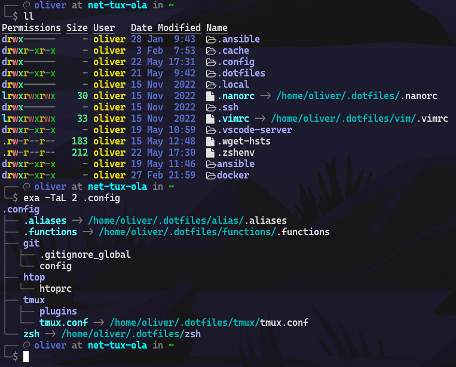

# dotfiles

## Usage
to clean the clutter in your ~ the ```XDG_CONFIG_HOME``` variable is a good advice to look at. [arch Wiki - XDG Base Directory](https://wiki.archlinux.org/title/XDG_Base_Directory)

a lot of applications will automatically use them or can easily be adviced to fetch the configuration from this directory.

as an Example for ZSH take a look in [.zshenv-sample](zsh/.zshenv-sample) copy this file to your home as .zshenv and link .dotfiles/zsh to .config/zsh 

```ln -s ~/.dotfiles/zsh ~/.config/zsh```

the variable ```ZDOTDIR``` in .zshenv-sample tells zsh to look at this folder and tries to load all neccessary files from this folder.

### Result



## Installation

Ansible could be used for this

### Ansible

```yml
# playbook.yml
---
- hosts: localhost

  tasks:
  - name: setup dotfiles
    ansible.builtin.import_tasks: ../roles/common/tasks/shell.yml
```

### Tasks File

```yml
---
- name: Git dotfiles repo
  ansible.builtin.git:
    repo: https://github.com/oliverl-21/dotfiles.git
    dest: "{{ ansible_facts.user_dir }}/.dotfiles"
    recursive: true
    clone: true
    update: true
    track_submodules: true
    version: master

- name: Create config Dir
  ansible.builtin.file:
    path: "{{ ansible_facts.user_dir }}/.config"
    state: directory

- name: Link functions
  ansible.builtin.file:
    src: "{{ ansible_facts.user_dir }}/.dotfiles/functions/.functions"
    dest: "{{ ansible_facts.user_dir }}/.config/.functions"
    state: link
    force: true

- name: Link aliases
  ansible.builtin.file:
    src: "{{ ansible_facts.user_dir }}/.dotfiles/alias/.aliases"
    dest: "{{ ansible_facts.user_dir }}/.config/.aliases"
    state: link
    force: true

- name: VIMrc
  ansible.builtin.file:
    src: "{{ ansible_facts.user_dir }}/.dotfiles/vim/.vimrc"
    dest: "{{ ansible_facts.user_dir }}/.vimrc"
    state: link
    force: true

- name: Nanorc
  ansible.builtin.file:
    src: "{{ ansible_facts.user_dir }}/.dotfiles/.nanorc"
    dest: "{{ ansible_facts.user_dir }}/.nanorc"
    state: link
    force: true

# bash setup
- name: Link bash_prompt
  ansible.builtin.file:
    src: "{{ ansible_facts.user_dir }}/.dotfiles/bash/.bash_prompt"
    dest: "{{ ansible_facts.user_dir }}/.bash_prompt"
    state: link
    force: true
  when:
    - ansible_facts.user_shell == "/bin/bash"

- name: Link bashrc
  ansible.builtin.file:
    src: "{{ ansible_facts.user_dir }}/.dotfiles/bash/.bashrc"
    dest: "{{ ansible_facts.user_dir }}/.bashrc"
    state: link
    force: true
  when:
    - ansible_facts.user_shell == "/bin/bash"

# zsh setup
- name: Link zsh
  ansible.builtin.file:
    src: "{{ ansible_facts.user_dir }}/.dotfiles/zsh"
    dest: "{{ ansible_facts.user_dir }}/.config/zsh"
    state: link
    force: true
  when:
    - "'zsh' is in ansible_facts.user_shell"

- name: Create tmux dir
  ansible.builtin.file:
    path: "{{ ansible_facts.user_dir }}/.config/tmux"
    state: directory

- name: Link tmux
  ansible.builtin.file:
    src: "{{ ansible_facts.user_dir }}/.dotfiles/tmux/tmux.conf"
    dest: "{{ ansible_facts.user_dir }}/.config/tmux/tmux.conf"
    state: link
    force: true

```
